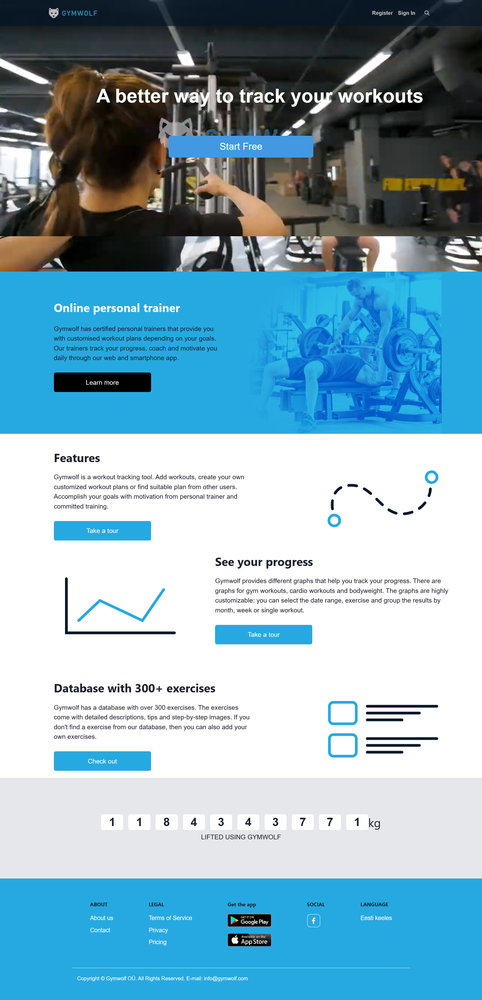
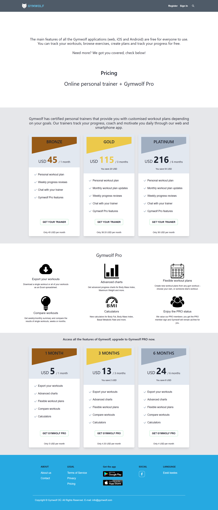
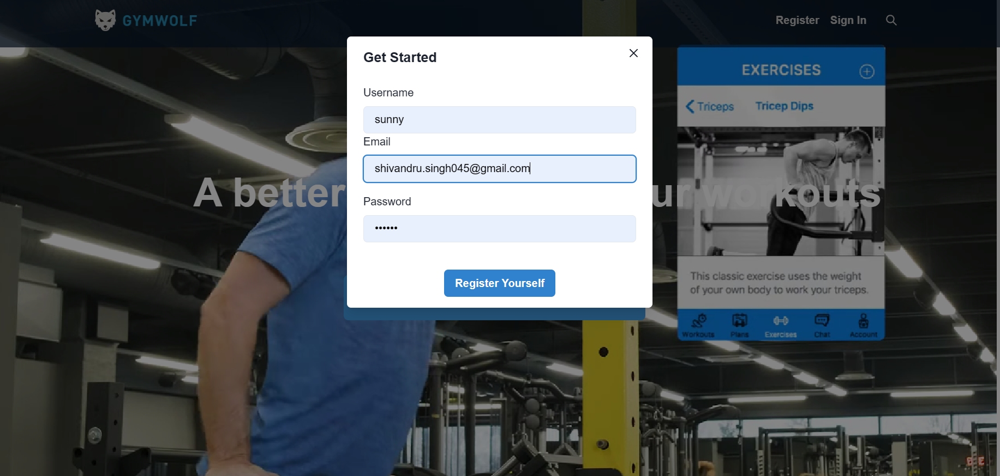
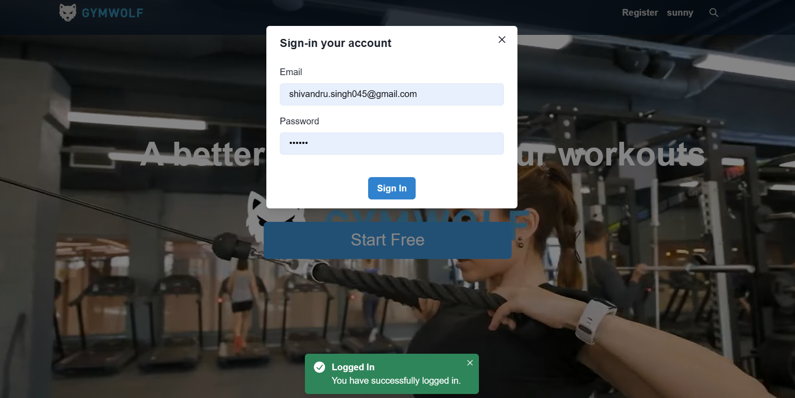

## Gymwolf

This is a clone of **GymWolf** website,  
Our goal is to make people happy and fit, to offer them the simplest way to track workouts and to communicate with personal trainer.

### Description

Gymwolf is a workout tracking tool that helps you keep track of your workouts and progress. You can add workouts, create your own customized workout plans, or find suitable plans from other users. Gymwolf has a database with over 300 exercises, each with detailed descriptions, tips, and step-by-step images. You can also add your own exercises if you don’t find them in the database. Gymwolf provides different graphs that help you track your progress, including graphs for gym workouts, cardio workouts, and bodyweight. The graphs are highly customizable: you can select the date range, exercise, and group the results by month, week, or single workout. Gymwolf also has certified personal trainers that provide you with customized workout plans depending on your goals. Our trainers track your progress, coach, and motivate you daily through our web and smartphone app. You can learn more about Gymwolf and its features at gymwolf.com.

### Functionalities are:

- Login
- Searching
- Different pages based on different category

### Tech Stack

- React
- Javascript ( ES6 )
- Chackra UI
- HTML
- CSS

### Installation Requirements

- Fork the repo, then clone it
- install all dependencies, with 'npm install'
- start the server 'npm run dev'

### Screenshort

